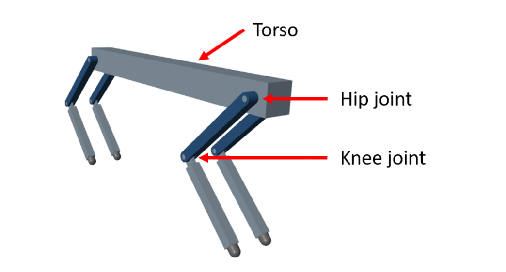

# Quadruped Gait Simulation and Control

||
 :--:|:--:|:--:
  *Walking* |*Trotting* | *Galloping*
  
## Methodology

### Step 1: Considering 2R planar Manipulator as a Single leg

The first move is to establish the limbs of the Walking Robot and for this, we are considering a 2R revolute planer manipulator to form a single leg. Each leg is connected with the main body i.e. Torso by a revolute joint. The angle between Torso and 1st link is called Hip Joint while the angle between the legs is called Knee Joint.

<!-- 
 :--:
*Quadruped Robot 3D Model* -->

<em>Quadruped Robot 3D Mode</em>

  

### Step 2: Iterate process for remaining 3 legs of Quadruped 

With the exact same dimensions and specifications, we multiplied and provided the robot with three more legs. After successfully establishing all the legs, a Torso is used to connect all of them in between and make it imply a rigid body. Each leg has its coordinate system located at the center of the first revolute joint. The center of the same joint is located at the thigh of the robot. We have considered the positive X-axis of the robot in the forward direction.

### Step 3: Calculation of Gait & Trajectory generation

To perform the locomotion of the robot we need to find the trajectory of each leg with respect to the others so it will perform forward and backward motion. This trajectory can be computed by Gait analysis of quadrupedal animals. For our reference, we are considering a horse gait for walking, throttling, and galloping action. Once we got Gait for the robot then we created an elliptical trajectory for each motion and each leg. After calculating the trajectory for each leg we will get the start point, endpoint, and multiple via points for the 2R manipulator leg.

### Step 4: Computing Inverse Kinematics based on Geometric approach

Once we got all points i.e. start, end, and via points, now it is time to find joint angle values for each position. To find joint values we use the DH parameter method with forward and inverse kinematics. Here we converted points from cartesian space to joint space. At each instant we will get joint angles for each robot leg.

### Step 5: Calculation of Joint Parameters for each position using IK

The most important part of simulation and animation is carried out via Simscape by feeding the output of Inverse Kinematics generated by trajectory generation. For the smoothness in the trajectory, the constant acceleration is used where each and every via point is covered in the path with a constant time duration at each point. The position parameters are fed as input to Inverse Kinematics which is calculated for a single leg for the initial simulation of the model. The process is the same and is repeated for the other legs involved in the workspace and is thus animated. In the last step, on tuning the hyperparameters of the simscape model we can attain different gait manipulation like walking, galloping, trotting.
